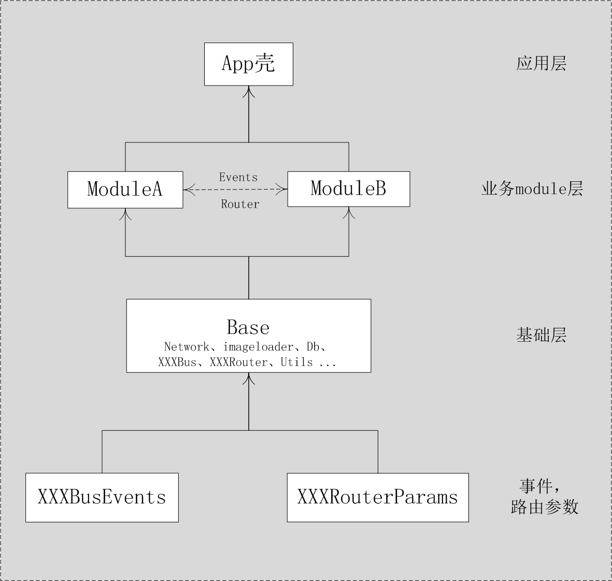
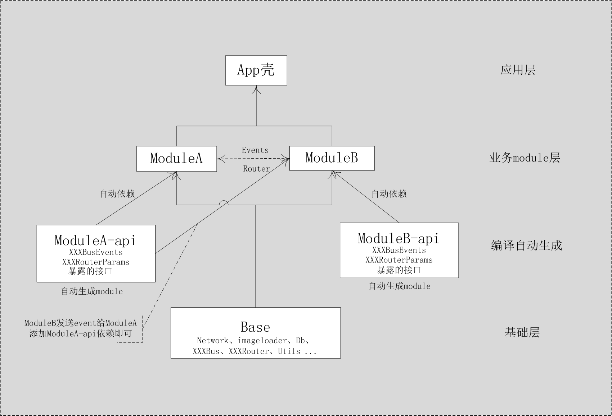
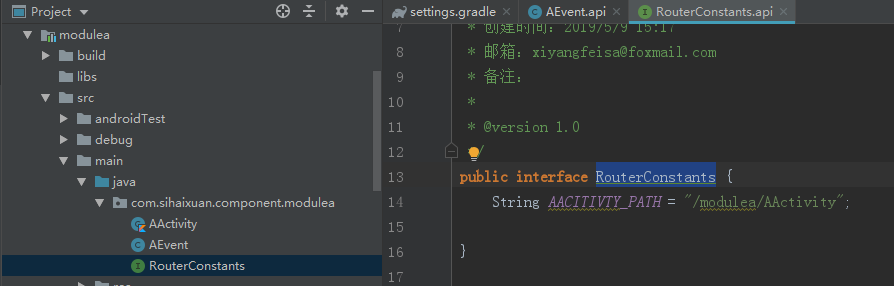
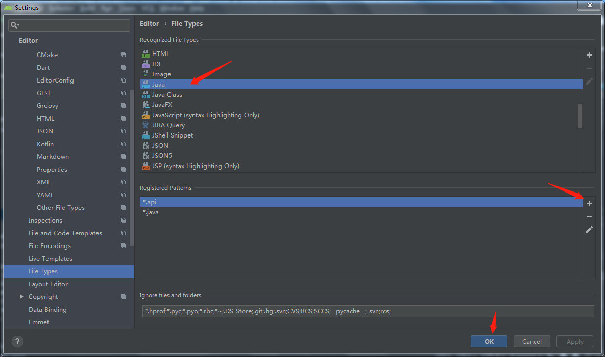
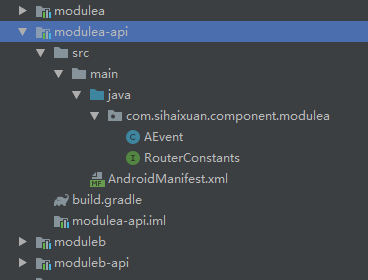
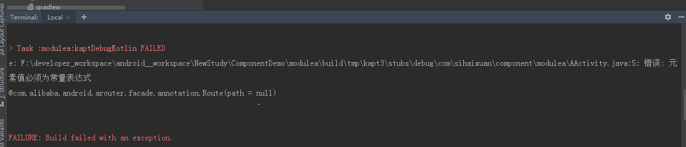
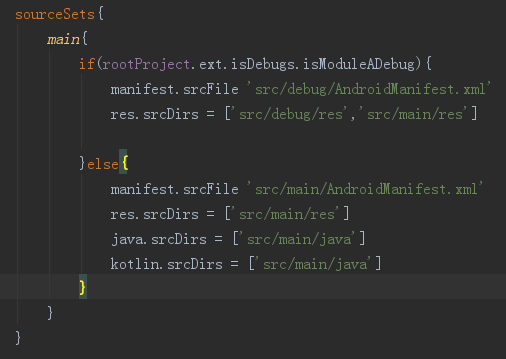

在将业务进行模块化时，避免不了模块页面路由和模块通信，
大多数我们会用到ARouter,EventBus三方库。
模块化过程中有一个尴尬的问题摆在面前：Event事件、Router path放在哪里？
因为很多业务module都需要收发Event事件,进行页面路由，所以只能将Event，
Router path下沉到基础库。
这样导致的结果是基础库越来越大，至多 把Event事件、Router path摆放在独立的module,然后基础库依赖这个库，如下图所示：



我们希望业务模块发送的事件，注解使用的Router path都在模块自己这里定义，而不是下层到基础库,当其他module需要路由、事件、
接口就暴露出来。关于这点《[微信Android模块化架构重构实践](https://cloud.tencent.com/developer/article/1005631)》
也提到了这件事情，并且自创性的使用了一种叫“.api”化的方式来解决这件事情。原理是在编译期将公用接口下沉到基础库同层级，
供其他module使用，而这段代码的维护仍然放到非基础库中。这种base库不会膨胀，代码维护的责任制更明确，确定挺不错。如下图：



在ModuleA，B把XXXBusEvents、XXXRouterParams,暴露的公用接口文件后缀名以.api
（并不要求一定.api后者，只要跟后续的自动Api化插件或者脚本一致就行）命名，
rebuild之后自动生成ModuleA-api，ModuleB-api 模块，ModuleA，B也会自动添加各自对应 api module依赖。

讲完了原理，下面就可以实现，这里使用ARouter,EventBus，只对Java文件进行Api化，步骤如下：

新建工程，创建base、moduleA、moduleB 模块在moudleA,moduleB中创建api文件



默认情况下，Android stuio 是不能识别.api文件，如果想编辑.api后缀的java文件，
为了能让Android Studio继续高亮该怎么办？可以在File Type中把.api作为java文件类型，操作如下图：



设置好后，可以在.api文件中像java文件一样愉快撸代码了，其他类可以引用.api中的类。

查看setting.gradle文件脚本如下：
```
include ':app', ':base',':modulea',':moduleb'
```
include 4个module,做个测试，在setting.gradle include test,同步后，test目录下只有iml文件，
没有build.gradle、AndroidManifest.xml等文件,所以除了拷贝.api文件到对应目录并重命名为.java，
还需要额外创建这两个文件，这里我事先在base module中准备了通用module的build.gradle文件，
拷贝到对应目录即可,AndroidManifest.xml就拷贝base module目录下的，脚本实现如下：
```
def includeWithApi(String moduleName,String baseModuleName) {
    //先正常加载这个模块
    include(moduleName)

    //找到这个模块的路径
    String originDir = project(moduleName).projectDir
    //这个是新的路径
    String targetDir = "${originDir}-api"
    //新模块的路径
    def sdkName = "${project(moduleName).name}-api"
    //新模块名字
    String apiName="${moduleName.substring(1,moduleName.length())}-api"


    //这个是公共模块的位置，我预先放了一个 ApiBuildGralde.gradle 文件进去
    String apiGradle = project(baseModuleName).projectDir

    // 每次编译删除之前的文件
    deleteDir(targetDir)

    //复制.api文件到新的路径
    copy() {
        from originDir
        into targetDir
        exclude '**/build/'
        exclude '**/res/'
        include '**/*.api'
    }

    //直接复制公共模块的AndroidManifest文件到新的路径，作为该模块的文件
    copy() {
        from "${apiGradle}/src/main/AndroidManifest.xml"
        into "${targetDir}/src/main/"
    }

    //file("${targetDir}/src/main/java/com/dhht/${apiName}/").mkdirs()

    //修改AndroidManifest文件
    //fileReader("${targetDir}/src/main/AndroidManifest.xml",apiName);

    //复制 gradle文件到新的路径，作为该模块的gradle
    copy() {
        from "${apiGradle}/ApiBuildGralde.gradle"
        into "${targetDir}/"
    }

    //删除空文件夹
    deleteEmptyDir(new File(targetDir))

    //重命名一下gradle
    def build = new File(targetDir + "/ApiBuildGralde.gradle")
    if (build.exists()) {
        build.renameTo(new File(targetDir + "/build.gradle"))
    }

    // 重命名.api文件，生成正常的.java文件
    renameApiFiles(targetDir, '.api', '.java')

    //正常加载新的模块
    include ":$sdkName"

}
```

修改setting.gradle文件如下：
```
include ':app', ':base'
includeWithApi(":modulea",":base")
includeWithApi(":moduleb",":base")
```

rebuild后，就可以看到moduleA-api,moduleB-api,并有对应的java文件如下图：




添加moduleA路由到moduleB，moduleB给moduleA发送事件逻辑，进行打包，会报如下错误：


很显然，ARouter注解处理器无法识别.api文件，path置为null处理，在moduleA,B添加对应的***-api模块依赖，就可以打包成功了。

奔着偷懒的原则，不想每次手动添加***-api模块依赖，自动动态添加依赖，实现gradle脚本如下：
```
ext{
     //自动添加***-api依赖
    autoImportApiDependency = {extension -> //extension project对象
        def children = project.rootProject.childProjects
        //遍历所有child project
        children.each {child ->
            //判断 是否同时存在 *** module 和 ***-api module
            if(child.key.contains("-api") && children.containsKey(child.key.substring(0,child.key.length() - 4))){
                print "\n"

                def targetKey = child.key.substring(0,child.key.length() - 4)
                def targetProject = children[targetKey]

                targetProject.afterEvaluate {

                    print '*********************\n'
                    print targetProject.dependencies
                    //通过打印 所有dependencies，推断需要添加如下两个依赖
                    targetProject.dependencies.add("implementation",targetProject.dependencies.create(project(":" + child.key)))
                    targetProject.dependencies.add("implementationDependenciesMetadata",targetProject.dependencies.create(project(":" + child.key)))

                    //打印 module 添加的依赖
                    targetProject.configurations.each {configuration ->
                        print '\n---------------------------------------\n'
                        configuration.allDependencies.each { dependency ->

                            print configuration.name + "--->" +dependency.group + ":" + dependency.name + ":" + dependency.version +'\n'
                        }

                    }


                    print '*********************\n'
                }

            }


        }
    }
}
```

autoImportApiDependency 方法封装在Config.gradle，在根build.gradle中调用
```
apply from: 'Config.gradle'
ext.autoImportApiDependency(this)
```

可以正常打包，并成功运行了。

###遇坑集锦：

1.kotlin集成ARouter，尽管设置了AROUTER_MODULE_NAME，依然报如下错误：
ARouter::Compiler An exception is encountered, [null] 
可以考虑是否是gradle和 kotlin 版本的问题。

2.业务模块moduleA处于集成模式时，即集成到App壳工程中去，也会将单一模块做
成App启动的源码和资源打包apk中，尽管设置了sourceSets,也没效果。



问题就出在debug文件夹的名字，把debug文件夹改成其他名字，就没有这个问题了，是不是很奇怪！没去究其原因。

参考资料：

[微信 Android 模块化架构重构实践（上）](https://cloud.tencent.com/developer/article/1005631)

[Android实现模块 api 化](https://www.jianshu.com/p/c4d1704f9680)

[美团猫眼电影Android模块化实战总结](https://www.jianshu.com/p/393b8e3c0cfa)


